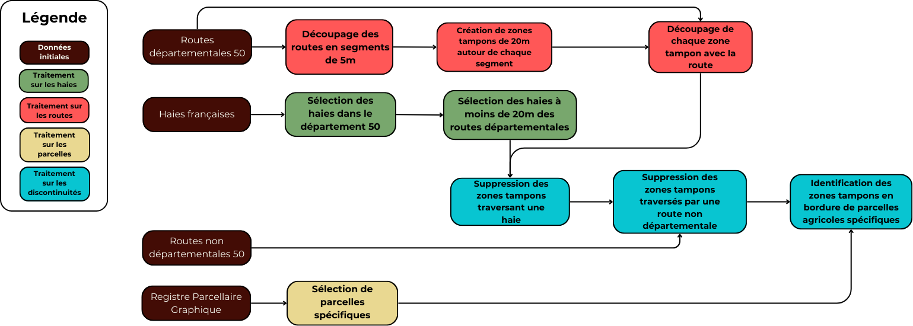

# projet_analyse_spatiale_CEREMA

**Etapes du traitement :**  
1. Détecter les discontinuités le long des routes  
2. Prioriser les replantations en fonctions des espaces protégés  
3. Hiérarchiser en fonction des pentes (ruissellement)

## 1. Sélection des discontinuités dans les haies
#### Données utilisées pour cette étape
* Les données sur les haies utilisées pour notre étude sont celles de la version 2 de la BD
haies l’IGN. Il s’agit de la couche nationale de référence des haies linéaires en France
métropolitaine. La version utilisée a été mis à jour en mars 2024 et réalisée à partir de
photo-interprétées d’images aériennes et de modèles numériques de surface datant de
2020 à 2022. Ces données sont disponibles au format geopackage en projection 2154.
* Les données sur les parcelles sont issues du Registre Parcellaire Graphique (RPG). Il
s’agit des parcelles de la version du RPG normand de 2023 au format shapefile.
* Les données sur les routes sont issues de la BDCARTO. IL s’agit des tronçons de route
du département de la Manche mis à jour au mois de septembre 2024. Ces données sont
disponibles au format vectoriel en projection 2154.
* Les données sur les routes départementales ont été fournies par notre commanditaire de projet, Florian Grillot.
### Récupération des haies situées à une distance de 20 mètres autour des routes
On utilise la requête SQL :
```
CREATE TABLE haie_route20_coupe AS (
    SELECT ST_Intersection(h.geom, ST_Buffer(r.geom, 20))
    FROM haie AS h, cd50
);
```

### Découpage des routes en segments de 5 mètres
La première étape consiste à diviser l’ensemble du réseau de routes départementales du département de la Manche en segments de 5 mètres. Ce découpage permet d’analyser précisément la présence ou l’absence de haies sur de très courtes distances, garantissant ainsi une meilleure finesse d’interprétation des résultats. Cette étape est effectuée avec la fonction ***Division des lignes par longueur maximale*** de QGIS en choisissant 5 mètres pour longueur et la couche des routes départementales en entrée.

### Création d’une zone tampon de 20 mètres
Autour de chaque segment de 5 mètres, une zone tampon d’un rayon de 20 mètres est générée. Cette zone permet d’englober les haies situées à proximité immédiate de la route et d’assurer une précision d’analyse à 5 mètres près. Cette étape a été réalisée grâce à la requête SQL suivante :
```
CREATE TABLE buffer_haie AS (
    SELECT (ST_Dump(ST_Difference(ST_Buffer(r1.geom, 20), r2.geom))).geom AS geom
    FROM cd50_coupe5m r1
    JOIN cd50_coupe5m r2 ON ST_Intersects(ST_Buffer(r1.geom, 20), r2.geom)
);
```

### Scission de la zone tampon en deux moitiés
Afin de pouvoir distinguer de quel côté de la route la haie est présente ou absente, chaque zone tampon est scindée en deux parties distinctes en prenant la route départementale comme axe de séparation. Cette opération permet d’analyser indépendamment chaque bord de route et d’identifier précisément les sections où une haie est manquante sur un côté seulement. On utilise la fonction ***Couper avec des lignes*** de QGIS avec les zones tampon en couche source et les routes départementales non découpées en couche de découpage, ce qui nous donne la table ***segment_buffer***.

### Suppression des segments de zones tampons intersectés par une haie
Enfin, pour isoler uniquement les zones où les haies sont absentes, tous les segments de zones tampons qui intersectent une haie sont supprimés. Cela signifie que seules les sections de route dépourvues de haies, sur l’un ou l’autre des côtés, sont conservées pour l’analyse finale. Cette étape a été réalisée grâce aux requêtes SQL suivantes :
```
CREATE TABLE segment_trou AS (
    SELECT b.*
    FROM segment_buffer b
    WHERE NOT EXISTS (
        SELECT 1 
        FROM haie_route20_coupe h
        WHERE ST_DWithin(b.geom, h.geom, 0.1) -- Réduit le nombre de tests
        AND ST_Intersects(b.geom, h.geom) -- Vérifie l'intersection réelle
    )
);
```

### Suppression des segments qui intersectent des routes non départementales
Pour ne pas indiquer des zones de plantation au niveau de routes, on applique le code suivant aux discontinuités :
```
CREATE TABLE non_dep AS (
    SELECT r.*
    FROM all_roads_bdcarto r
    WHERE r.cpx_classement_administratif != 'Départementale' 
       OR r.cpx_classement_administratif IS NULL
);

CREATE TABLE trou_5m_sans_route AS (
    SELECT s.*
    FROM segment_trou_5m s
    WHERE NOT EXISTS (
        SELECT 1 
        FROM non_dep n
        WHERE ST_DWithin(n.geom, s.geom, 0.1) -- Réduit le nombre de tests
        AND ST_Length(ST_Intersection(n.geom, s.geom)) > 2 -- Vérifie l'intersection réelle
    )
);
```

### Identification des discontinuités en bordure de parcelles agricoles
On utilise le RPG. Pour cette étape, on ne prend pas en compte les parcelles agricoles couvertes par des prairies permanentes, des prairies temporaires, des estives et landes, des vergers ou du gel ne sont pas prises en compte, selon la demande du commanditaire, en raison du plus faible ruissellement sur ces parcelles. Les traitements suivants se feront alors sur les parcelles non visées par ces catégories :
```
CREATE TABLE trou_5m_sans_route_et_parcelles AS (
    SELECT s.*
    FROM trou_5m_sans_route AS s
    JOIN (
        SELECT s.geom AS s_geom, ST_Area(ST_Union(ST_Intersection(ST_Buffer(p.geom, 0), ST_Buffer(s.geom, 0)))) AS inter_area
        FROM trou_5m_sans_route s
        JOIN parcelle_manche p ON ST_DWithin(p.geom, s.geom, 0.1)
        WHERE ST_IsValid(s.geom) AND ST_IsValid(p.geom)
        GROUP BY s.geom
    ) AS inter ON inter.s_geom = s.geom
    WHERE inter.inter_area > (0.75 * ST_Area(s.geom))
);
```

Ces étapes sont illustrée dans le workflow suivant :  
\



## 2. Hiérarchisation des zones avec les espaces protégés et réservoirs de biodiversité

Reprojection et harmonisation des couches d'espaces protégés en 2154 pour rendre les données homogènes.
- **`creation_espaces_prot.sql`** : Regroupe l’ensemble des espaces protégés dans une même couche, en précisant leur type en attribut, et effectue un découpage par le département de la Manche.  
- **`importance.sql`** : Associe une valeur d’importance aux espaces protégés.  
- **`réservoirs.sql`** : Crée une nouvelle couche combinant les espaces protégés et les réservoirs, en leur attribuant une valeur d’importance sur 10.  
- **`associe_importance_trous.sql`** : Affecte aux discontinuités de haies la valeur maximale d’importance, en fonction de l’espace protégé ou du réservoir dans lequel elles se trouvent. 

## 3. Étude sur les pentes des terrains agricoles en bordure de route

### Calcul de l'indice d'accumulation grâce au MNT

L'indice utilisé pour évaluer l'exposition des routes au ruissellement est l'accumulation de flux calculé par le SIG Grass. Pour ce faire, on lance dans le logiciel le code **`analyse_mnt_flux.py`**.
Celui-ci prend en entrée le dossier contenant toutes les dalles de MNT au format ASC, et crée pour chacune un fichier TIFF dans un dossier en sortie.

### Attribution d'un indicateur d'importance aux trous de la couche des discontinuités

Cette dernière étape est effectuée par le code **`classif_trous_ruissellement.py`**, qui prend en entrée :
* La couche des discontinuités
* Le dossier créé à l'étape précédente contenant les fichiers TIFF de l'accumulation d'eau

Il crée alors un fichier au format Shapefile contenant pour chaque discontinuité son identifiant et la valeur d'accumulation la plus haute qu'elle intesecte, arrondie à la dixaine inférieure.


## 4. Identification des zones prioritaires pour la plantation de haies avec les critères écologiques et hydrologiques

- Jointure des couches de bords de route sans haie avec les données d'importance de zones protégées et les données de ruissellement créant la couche "trou_flux_et_proteges".
- Normalisation des indices d'importance écologique (attribut : "importance") et d'écoulement (attribut : "ecoulement"), donne les résultats dans l'attribut : "norm_prot" et "norm_ecoul"
- Pondération pour créer un indice global de priorité : Priorité = (écoulement normalisé × 0.5) + (importance espaces normalisée × 0.5), attribut : "param50_50"
